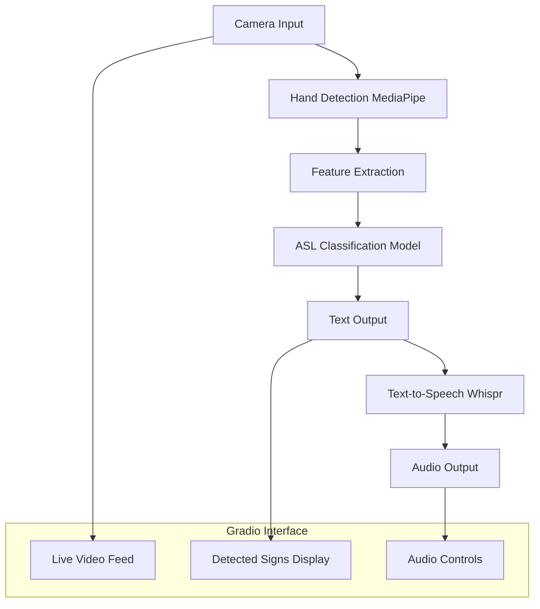
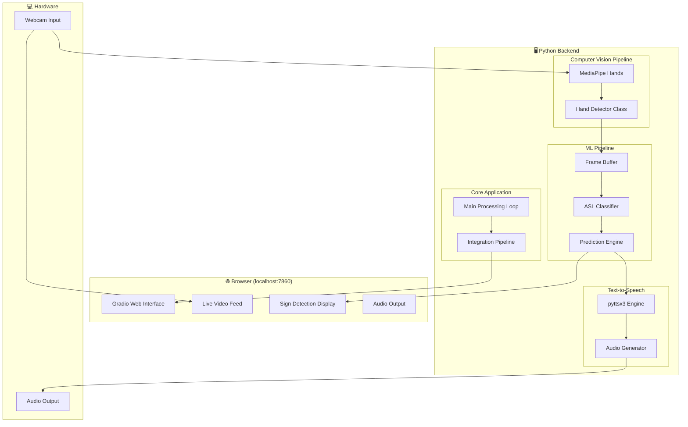

# ASL Real-time Interpreter

## Architecture Overview




## Core Components

### 1. Computer Vision Pipeline

- **MediaPipe Hands**: Real-time hand landmark detection and tracking
- **Feature Engineering**: Extract hand pose features (21 landmarks per hand, normalized coordinates)
- **Preprocessing**: Frame buffering, smoothing, and gesture segmentation

### 2. ASL Classification Model

- **Model Architecture**: CNN-LSTM or Transformer-based model for sequence classification
- **Training Data**: ASL dataset (ASL-LEX, MS-ASL, or custom dataset)
- **Output**: Confidence scores for common ASL words/phrases (100-500 vocabulary)

### 3. Text-to-Speech Integration

- **Whispr Model**: Integration for natural voice synthesis
- **Audio Pipeline**: Real-time audio generation and playback
- **Voice Customization**: Configurable voice parameters

### 4. Gradio Web Interface

- **Live Video Stream**: Real-time camera feed with overlay annotations
- **Detection Display**: Current and recent detected signs
- **Audio Controls**: Play/pause, volume, voice settings
- **Performance Metrics**: Confidence scores, detection latency

## Technical Implementation

### Dependencies and Setup

```python
# requirements.txt
gradio>=4.0.0
mediapipe>=0.10.0
opencv-python>=4.8.0
tensorflow>=2.13.0  # or pytorch>=2.0.0
numpy>=1.24.0
whispr  # or alternative TTS library
sounddevice>=0.4.0
pillow>=10.0.0
```

### Project Structure

```
sign-language-interpreter/
├── src/
│   ├── models/
│   │   ├── hand_detector.py      # MediaPipe integration
│   │   ├── asl_classifier.py     # ML model for ASL recognition
│   │   └── tts_engine.py         # Text-to-speech integration
│   ├── utils/
│   │   ├── preprocessing.py      # Video/image preprocessing
│   │   ├── feature_extraction.py # Hand landmark processing
│   │   └── audio_utils.py        # Audio processing utilities
│   ├── ui/
│   │   └── gradio_app.py         # Main Gradio interface
│   └── main.py                   # Application entry point
├── data/
│   ├── models/                   # Trained model weights
│   └── vocabulary/               # ASL vocabulary definitions
├── notebooks/                    # Development and training notebooks
├── tests/                        # Unit tests
├── requirements.txt
└── README.md
```

### Key Implementation Files

#### `[src/models/hand_detector.py](src/models/hand_detector.py)`

- MediaPipe Hands initialization and configuration
- Real-time hand landmark extraction
- Hand tracking and gesture segmentation

#### `[src/models/asl_classifier.py](src/models/asl_classifier.py)`

- Pre-trained ASL classification model loading
- Feature vector processing
- Confidence-based prediction filtering

#### `[src/ui/gradio_app.py](src/ui/gradio_app.py)`

- Gradio interface setup with video input/output
- Real-time processing pipeline integration
- Audio playback controls and settings

#### `[src/main.py](src/main.py)`

- Application orchestration
- Configuration management
- Error handling and logging

## Data Flow

1. **Video Capture**: Continuous frame capture from webcam
2. **Hand Detection**: MediaPipe processes each frame to detect hand landmarks
3. **Feature Processing**: Extract and normalize hand pose features
4. **Gesture Recognition**: Sliding window approach for temporal gesture recognition
5. **ASL Classification**: ML model predicts ASL signs from feature sequences
6. **Text Generation**: Convert predictions to readable text with confidence filtering
7. **Speech Synthesis**: Whispr converts text to natural speech
8. **UI Updates**: Real-time display of video, detected text, and audio controls

## Model Training Strategy

### Data Collection

- Use existing ASL datasets (ASL-LEX, MS-ASL)
- Augment with synthetic data generation
- Focus on 100-500 most common ASL words/phrases

### Model Architecture

- **Input**: Sequence of hand landmark coordinates (42 points × N frames)
- **Processing**: CNN for spatial features + LSTM/Transformer for temporal patterns
- **Output**: Softmax classification over vocabulary

### Training Pipeline

- Data preprocessing and augmentation
- Transfer learning from pre-trained gesture recognition models
- Cross-validation with different signers
- Performance optimization for real-time inference

## Performance Considerations

### Real-time Requirements

- **Target Latency**: <200ms end-to-end processing
- **Frame Rate**: 30 FPS video processing
- **Model Optimization**: TensorRT/ONNX optimization for inference speed

### Accuracy Improvements

- **Temporal Smoothing**: Multi-frame averaging for stable predictions
- **Confidence Thresholding**: Filter low-confidence predictions
- **Context Awareness**: Use previous predictions to improve accuracy

## Deployment and Testing

### Local Development

- Gradio development server with hot reload
- Webcam testing with various lighting conditions
- Performance profiling and optimization

### Testing Strategy

- Unit tests for each component
- Integration tests for full pipeline
- User acceptance testing with ASL users
- Performance benchmarking

## 2-Hour Hackathon Team Delegation Strategy

### Team Composition (4 People)

- **Person 1**: ML Expert (Team Lead)
- **Person 2**: Computer Vision Developer  
- **Person 3**: UI/Frontend Developer
- **Person 4**: Integration & Testing Specialist

## Detailed Architecture & End Product

### What You're Building: Real-Time ASL Interpreter Demo

**End Product**: A web application where users can:

1. Point their webcam at ASL hand signs
2. See live video feed with hand tracking overlay
3. View detected signs as text in real-time
4. Hear the detected signs spoken aloud
5. See confidence scores and sign history

### System Architecture Deep Dive




### Data Flow & Interfaces

#### Person 2 → Person 1 Interface

```python
# hand_detector.py output → asl_classifier.py input
def get_hand_landmarks(frame):
    return {
        'landmarks': [[x1,y1,z1], [x2,y2,z2], ...],  # 21 points
        'hand_present': bool,
        'confidence': float,
        'timestamp': time.time()
    }
```

#### Person 1 → Person 3 Interface

```python
# asl_classifier.py output → gradio_app.py input
def predict_sign(landmarks_sequence):
    return {
        'predicted_sign': "HELLO",
        'confidence': 0.87,
        'top_3': [("HELLO", 0.87), ("HI", 0.12), ("WAVE", 0.01)]
    }
```

#### Person 3 → Person 4 Interface

```python
# gradio_app.py → main.py integration
def create_interface():
    return gr.Interface(
        fn=process_video_frame,
        inputs=gr.Video(source="webcam"),
        outputs=[gr.Text(), gr.Audio()]
    )
```

### Parallel Work Breakdown

```mermaid
gantt
    title 2-Hour Hackathon Timeline
    dateFormat HH:mm
    axisFormat %H:%M
    
    section Setup (10min)
    Project Init & Dependencies    :setup, 00:00, 00:10
    
    section Hour 1 (Parallel Development)
    Hand Detection (Person 2)      :cv, 00:10, 01:10
    ASL Model Integration (Person 1) :ml, 00:10, 01:10
    Basic Gradio UI (Person 3)     :ui, 00:10, 01:10
    Testing Framework (Person 4)   :test, 00:10, 01:10
    
    section Hour 2 (Integration & Demo)
    Pipeline Integration (All)     :integration, 01:10, 01:40
    TTS & Polish (Person 1&3)      :polish, 01:40, 01:55
    Final Testing (Person 2&4)     :debug, 01:40, 01:55
    Demo Prep (All)                :demo, 01:55, 02:00
```




### Detailed Task Assignment

#### Person 1: ML Expert (Team Lead) - 🧠 Core Intelligence

**Hour 1: ASL Model Integration (60 min)**

- Set up pre-trained ASL model (use existing models from TensorFlow Hub or Hugging Face)
- Create `src/models/asl_classifier.py` with basic classification pipeline
- Implement simple gesture-to-text mapping for 10-20 common signs
- **Deliverable**: Working ASL classifier that can process hand landmarks

**Hour 2: Pipeline Coordination (60 min)**

- Integrate all components in `src/main.py`
- Handle data flow between CV → ML → UI
- **Deliverable**: End-to-end pipeline working

**Hour 3: TTS Integration (30 min)**

- Add simple TTS using `pyttsx3` (faster than Whispr for hackathon)
- **Deliverable**: Voice output working

#### Person 2: Computer Vision Developer - 👁️ Eyes of the System

**Hour 1: Hand Detection (60 min)**

- Implement `src/models/hand_detector.py` using MediaPipe
- Create real-time hand landmark extraction
- Add basic gesture segmentation
- **Deliverable**: Live hand tracking with landmark coordinates

**Hour 2: Integration Support (60 min)**

- Help integrate CV pipeline with ML model
- Optimize frame processing for real-time performance
- **Deliverable**: Smooth CV → ML data flow

**Hour 3: Testing & Debug (30 min)**

- Test with different lighting conditions
- Debug performance issues
- **Deliverable**: Stable computer vision component

#### Person 3: UI/Frontend Developer - 🎨 User Experience

**Hour 1: Basic Gradio Interface (60 min)**

- Create `src/ui/gradio_app.py` with video input/output
- Add text display area for detected signs
- Basic layout and styling
- **Deliverable**: Working Gradio interface with video feed

**Hour 2: Integration Support (60 min)**

- Connect UI to backend pipeline
- Add real-time text updates
- **Deliverable**: Live UI showing detection results

**Hour 3: UI Polish (30 min)**

- Add audio controls and status indicators
- Improve visual design and user experience
- **Deliverable**: Polished, demo-ready interface

#### Person 4: Integration & Testing Specialist - 🔧 System Reliability

**Hour 1: Project Setup & Testing Framework (60 min)**

- Initialize project structure and virtual environment
- Install all dependencies (`requirements.txt`)
- Create basic testing utilities
- Set up error handling and logging
- **Deliverable**: Clean project setup ready for development

**Hour 2: Integration Support (60 min)**

- Help connect all components
- Handle error cases and edge conditions
- **Deliverable**: Robust system integration

**Hour 3: Final Testing & Debug (30 min)**

- End-to-end testing
- Performance optimization
- Demo preparation
- **Deliverable**: Bug-free demo-ready system

### Simplified MVP Scope for 3 Hours

#### Core Features (Must Have)

1. **Hand Detection**: MediaPipe hand tracking
2. **Basic ASL Recognition**: 10-15 common signs (A-Z letters + "Hello", "Thank you", "Yes", "No")
3. **Text Display**: Show detected signs in real-time
4. **Simple TTS**: Basic voice output using `pyttsx3`
5. **Gradio Interface**: Video input/output with text display

#### Nice-to-Have (If Time Permits)

1. Confidence scores display
2. Sign history/log
3. Audio controls (volume, voice selection)
4. Better visual feedback

### Communication Strategy

- **Slack/Discord**: Quick updates every 30 minutes
- **Shared Repository**: Git with feature branches
- **Integration Points**: 
  - Hour 1 End: Component demos
  - Hour 2 End: Integrated system test
  - Hour 3 End: Final demo prep

### Risk Mitigation

1. **Backup Models**: Have 2-3 pre-trained ASL models ready
2. **Simplified Scope**: Focus on letters/basic words if full words are too complex
3. **Mock Components**: Create mock versions if real components fail
4. **Demo Script**: Prepare demo scenarios that showcase working features

### Success Metrics

- ✅ Live video feed with hand detection
- ✅ At least 10 signs correctly recognized
- ✅ Text-to-speech working for detected signs
- ✅ Smooth, demo-ready user interface
- ✅ End-to-end pipeline processing in <1 second

## Future Enhancements (Post-Hackathon)

1. **Extended Vocabulary**: Expand from words to full sentences
2. **Multi-hand Support**: Two-handed sign recognition
3. **Facial Expressions**: Incorporate facial features for grammar
4. **Mobile App**: React Native or Flutter mobile version
5. **Cloud Deployment**: Scalable web service deployment

